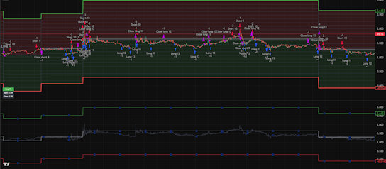

# Grid Bot

## Over[view](<plugins/Grid Bot [Grid range plugin] Z-Score [psyll].pine>)

Grid Bot is an advanced Pine Script strategy developed for TradingView, designed to elevate automated grid trading to a new standard of precision and adaptability. This script incorporates a sophisticated parameter system and a modular plugin architecture, empowering traders to dynamically configure grid ranges and exercise comprehensive control over order placement and execution. In contrast to traditional grid strategies, which often falter in volatile or unpredictable market environments, Grid Bot emphasizes resilience and extensibility. It provides a robust framework that maintains stability across diverse market conditions while facilitating seamless integration of custom enhancements.

By releasing Grid Bot as freeware, the developer, Psyll, aims to deliver a professional-grade tool that serves multiple purposes: as a reference implementation for educational insights into algorithmic trading, as a production-ready solution for active deployment in live trading scenarios, and as a foundational platform for ongoing research and development. This strategy is particularly suited for traders seeking to optimize their approaches in range-bound markets, where grid trading can capitalize on price oscillations within defined boundaries. The modular design encourages community contributions, allowing users to build upon the core functionality with personalized plugins tailored to specific trading styles or asset classes.

Grid Bot's core philosophy revolves around user empowerment through flexibility. Traders can manually define grid parameters based on technical analysis or leverage automated plugins for dynamic adjustments. This dual approach ensures accessibility for a broad spectrum of users while accommodating advanced customization needs. Whether applied to cryptocurrencies, forex, or equities, Grid Bot promotes disciplined trading by incorporating risk management features such as maximum drawdown limits and automatic shutdown mechanisms when market conditions deviate from expected ranges.

## Getting Started - Initial setup

To initiate Grid Bot on a TradingView chart, begin by adding the script to your selected asset's chart. Upon activation, the script will prompt you with an instructional message: `Set the "start" time for "Grid Bot [psyll]".` At this stage, interact with the chart by clicking to designate the precise timestamp at which the strategy should commence operations. This interactive setup ensures that the bot aligns with your intended trading session, accounting for historical data and real-time market entry points.

Following the start time selection, the script will request the definition of the grid's vertical boundaries. You will see prompts for `select grid high range` and `select grid low range.` Respond by clicking on the chart to mark the upper and lower price levels that delineate the grid's operational zone. These selections are critical, as they establish the range within which the bot will place and manage orders. To facilitate informed decision-making, consider incorporating technical indicators such as support and resistance levels, moving averages, or Fibonacci retracements when choosing these points.

Once the grid boundaries are set, Grid Bot will present a confirmation dialog summarizing the provided parameters, including the start time and grid ranges. Re[view](<plugins/Grid Bot [Grid range plugin] Z-Score [psyll].pine>) this information carefully for accuracy, as it forms the basis of the strategy's execution. Accepting the parameters activates the bot, initiating monitoring of price movements within the defined grid. This user-friendly onboarding process minimizes setup complexity while ensuring transparency and control from the outset.

## Target Audience

Grid Bot is primarily tailored for intermediate and advanced traders who possess a solid understanding of market dynamics and technical analysis. Manually configuring the grid ranges requires knowledge of key concepts such as support and resistance zones, trend identification, and volatility assessment. For instance, users should be capable of analyzing historical price data to pinpoint areas where price reversals are likely, thereby optimizing the grid's placement for maximum efficiency.

That said, the strategy's plugin ecosystem extends its accessibility. Beginners transitioning to more sophisticated trading can utilize pre-built or custom plugins to automate parameter settings and grid range adjustments. This feature bridges the gap between manual oversight and algorithmic precision, enabling users to gradually build expertise while benefiting from automated enhancements. Advanced traders, on the other hand, will appreciate the depth of customization, allowing integration with external indicators or proprietary algorithms to refine entry, exit, and risk management logic.

In essence, Grid Bot caters to those committed to algorithmic trading as a disciplined practice. It is not intended for novice users without foundational knowledge, as improper configuration could lead to suboptimal performance or increased risk exposure. Traders in range-bound markets, such as sideways-trending assets, will find it particularly valuable, while those in strongly trending environments may need to adapt via plugins or complementary strategies.
Features and Settings

Grid Bot offers a comprehensive suite of configurable settings, categorized for ease of navigation. These parameters allow fine-tuned control over display elements, runtime behavior, grid structure, entry and exit conditions, and dynamic manipulations. Below is a detailed breakdown of each section, including explanations of their functionalities and practical considerations for implementation.

## Settings

### Display

These options govern the visual representation of the strategy on the chart, enhancing interpretability without cluttering the interface.

- **Positions Table:** Enables the display of a detailed table summarizing active positions, including entry prices, quantities, profit/loss metrics, and status updates. This feature is invaluable for real-time monitoring, providing a consolidated [view](<plugins/Grid Bot [Grid range plugin] Z-Score [psyll].pine>) that aids in quick decision-making during live sessions.
- **Grid Lines:** Toggles the visibility of horizontal lines representing the grid levels. When activated, these lines clearly demarcate the trading zones, assisting in visual confirmation of price interactions with grid boundaries.
- **Color Candles:** Applies color coding to candlesticks based on the direction of open positions (e.g., green for longs, red for shorts). This intuitive visualization helps traders gauge market sentiment and position bias at a glance, complementing other technical tools.

### Runtime

Control the temporal scope of the strategy's operation.

- **Start:** Defines the initiation point of the bot, as set during the initial setup. This parameter ensures the strategy only processes data from the specified timestamp onward, preventing retroactive interference with historical trades.
- **End:** Specifies an optional termination point for the strategy. If configured, the bot will cease operations upon reaching this time, allowing for scheduled trading sessions or alignment with market hours.

### Grid

Fundamental to the strategy's core mechanics.

- **Grids:** Determines the number of grid lines within the defined range. A higher count increases granularity, potentially leading to more frequent but smaller trades, while fewer lines promote larger position sizing for broader market swings.

### Entry

Configure how and when orders are initiated.

- **Direction:** Selects the trading orientation - `Longs` only, `Shorts` only, or `Both`. This setting aligns the bot with bullish, bearish, or neutral market expectations, offering versatility across different asset behaviors.
- **Mode**: Introduces `Burst Mode,` which alters the entry logic to accelerate order placement in high-volatility scenarios, potentially capturing rapid price movements more aggressively.
- **First Entry:** Offers an `Instant` option that triggers the initial order immediately upon price entering the grid zone, reducing latency and ensuring prompt engagement with market opportunities.
- **Long Source**: Specifies the data input (e.g., `close`,`high`, `low`) used to signal long entries, allowing customization based on preferred technical signals.
- **Short Source:** Analogous to Long Source but for short positions, ensuring symmetry or asymmetry in entry criteria as needed.

###  Exit

Define closure mechanisms to secure profits or mitigate losses.

- **Mode:** Provides multiple exit methodologies, such as fixed targets, trailing stops, or indicator-based signals, catering to various risk-reward profiles.
- **Long Source:** Data source for triggering long position exits, parallel to entry sources for consistent logic.
- **Short Source:** Corresponding source for short exits.
- **Trailing Points:** Sets the distance in points for trailing stops when `Exit Mode` is configured as `Trailing`, dynamically adjusting to lock in gains as prices move favorably.
- **Trailing Offset:** Establishes an initial offset for the trailing mechanism, fine-tuning sensitivity to price fluctuations.
- **Stoploss When the Price Leaves the Grid:** Automatically closes all open orders if price exits the grid boundaries, serving as a protective measure against breakouts.
- **Disable Order Entries After Price Leaves the Grid:** Halts new order placements upon grid exit, effectively pausing the bot to prevent unintended exposures.
- **Max Drawdown:** Imposes a threshold on cumulative losses; exceeding this value triggers a complete shutdown, enforcing risk management discipline.

###  Exit Manipulator

Advanced tools for adjusting exit parameters dynamically.

- **Position:** Modifies the spacing between subsequent purchases for pyramiding, either compressing or expanding based on current position count to optimize averaging strategies.
- **Time:** Adjusts purchase distances temporally, factoring in elapsed time since order initiation to adapt to evolving market conditions.

### Grid Range

Static definitions of the operational boundaries.

- **Grid Top:** The upper price limit of the grid.
- **Grid Bottom:** The lower price limit of the grid.

### Grid Range Manipulation

Dynamic adjustments to boundaries.

- **Position:** Scales Grid Top and Bottom proportionally to held positions, facilitating adaptive pyramiding.
- **Time:** Alters boundaries based on time since the first position, accommodating longer-term sessions.

### Grid Middle Manipulation

Focused on the central grid line.

- **Position:** Shifts the middle line relative to position quantity.
- **Time:** Adjusts the middle line over time from session start.

## Plugins

Grid Bot's extensibility shines through its plugin system, which allows integration of external modules for enhanced automation and control.

### Grid Range Plugins
These plugins transition grid boundaries from static to dynamic management. Users can assign independent plugins for Top/Bottom and Middle separately, drawing from indicators like moving averages or volatility metrics to auto-adjust ranges in response to market shifts.

| Plugin name          | Code                                                                             | Screenshot                                                                        |
| -------------------- | -------------------------------------------------------------------------------- | --------------------------------------------------------------------------------- |
| Z-Score              | [View](<plugins/Grid Bot [Grid range plugin] Z-Score [psyll].pine>)              |                            |
| Two Moving Avarages  | [View](<plugins/Grid Bot [Grid range plugin] Two Moving Avarages [psyll].pine>)  |    |
| Supertrend Channel   | [View](<plugins/Grid Bot [Grid range plugin] Supertrend Channel [psyll].pine>)   |      |
| RSI Channel          | [View](<plugins/Grid Bot [Grid range plugin] RSI Channel [psyll].pine>)          |                    |
| Predictive Ranges    | [View](<plugins/Grid Bot [Grid range plugin] Predictive Ranges [psyll].pine>)    |        |
| Murrey Lines         | [View](<plugins/Grid Bot [Grid range plugin] Murrey Lines [psyll].pine>)         |                   |
| Moving Avarage StDev | [View](<plugins/Grid Bot [Grid range plugin] Moving Avarage StDev [psyll].pine>) |  |
| High/Low             | [View](<plugins/Grid Bot [Grid range plugin] HighLow [psyll].pine>)              |                           |
| Bollinger Bands      | [View](<plugins/Grid Bot [Grid range plugin] Bollinger Bands [psyll].pine>)      |            |

### Direction Plugins

Enable runtime switching of trading directions based on external signals, such as trend indicators or sentiment analysis, promoting adaptive strategies that respond to real-time data.

| Plugin name      | Code                                                                        | Screenshot                                                                |
| ---------------- | --------------------------------------------------------------------------- | ------------------------------------------------------------------------- |
| Supertrend Pivot | [View](<plugins/Grid Bot [Direction plugin] Supertrend Pivot [psyll].pine>) |  |
| Price Deviation  | [View](<plugins/Grid Bot [Direction plugin] Price Deviation [psyll].pine>)  |    |

### Controller Plugins

Facilitate granular order management, including opening, closing or blocking trades via custom logic. This is ideal for incorporating advanced risk controls or hybrid strategies.

| Plugin name | Code                                                                | Screenshot                                                |
| ----------- | ------------------------------------------------------------------- | --------------------------------------------------------- |
| Big Move    | [View](<plugins/Grid Bot [Controler plugin] Big Move [psyll].pine>) |  |

## Live Trading via Psyll.com Webhooks

:link: Visit [ Psyll.com Webhook](https://psyll.com/en/webhook) page at https://psyll.com/en/webhoo

Grid Bot can be extended beyond simulation and backtesting by integrating it with live trading environments through TradingViews alert system and Psyll.com's webhook functionality. This integration enables the execution of real orders on supported exchanges without incurring additional costs for basic usage, leveraging a free tier that facilitates automated trading strategies in production settings.

